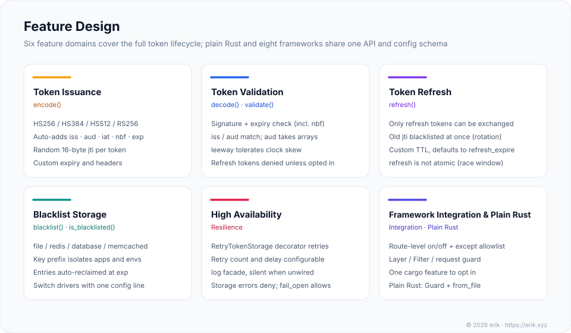
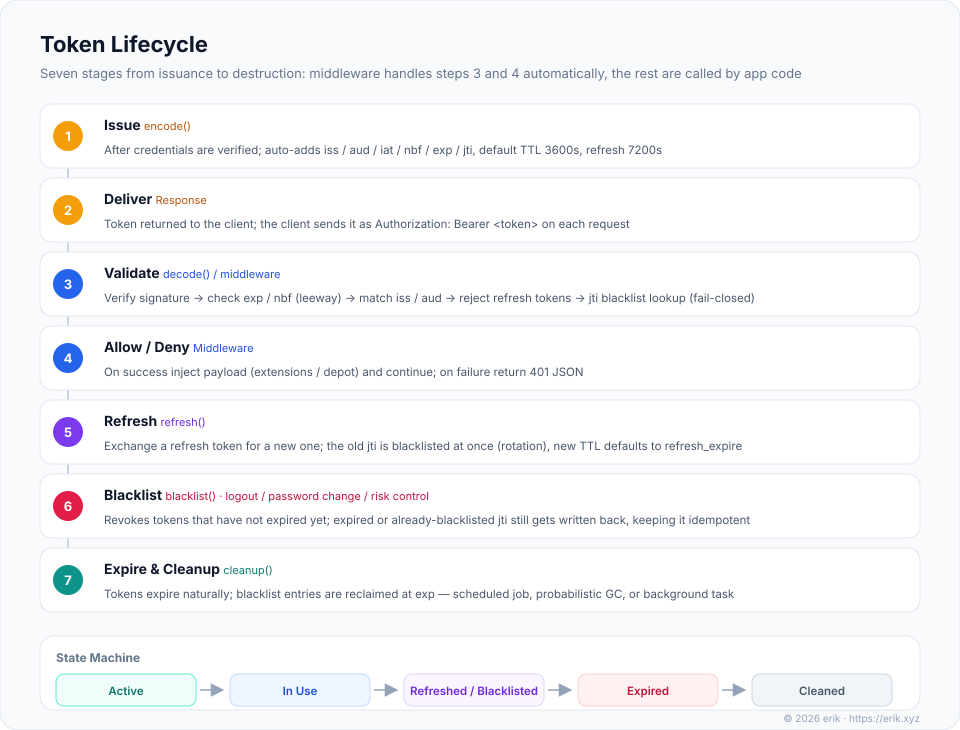

# erikwang2013/jwt-rust

中文版：[README.md](./README.md) · Chinese version

<div align="center">

[](https://github.com/erikwang2013/jwt-rust/actions/workflows/ci.yml)
[](https://crates.io/crates/jwt-rust)
[](https://docs.rs/jwt-rust)
[](./LICENSE)

</div>

<div align="center">
  
</div>

A JWT authentication plugin compatible with axum, actix-web, rocket, poem, salvo, warp, bee-rust and e-cat, and equally usable in plain Rust projects without any framework. One framework-agnostic core + nine integration paths + four pluggable blacklist stores, built for distributed deployments and quick to install.

<div align="center">
  
  <br />
  <sub>Project mascot · <b>Kee 钥匙小卫</b> — the key head is the framework-agnostic core, the eight teeth on the blade are the eight framework adapters, and the shield on its chest is validation and the blacklist</sub>
</div>

Author: [艾瑞可erik / erik](https://erik.xyz)

## Project Overview

`erikwang2013/jwt-rust` is a multi-framework JWT authentication plugin for Rust, with a core built on top of `jsonwebtoken`.

Documentation is bilingual: this README (English) and [README.md](./README.md) (Chinese version); the architecture / features / lifecycle diagrams each exist in both languages (each figure links below to its counterpart).

### Positioning

Traditional JWT plugins are usually bound to a single framework. In a microservice or multi-project architecture, each framework then needs its own JWT integration, which drives up maintenance cost and creates the risk of inconsistent authentication logic.

This plugin decouples the core logic from frameworks entirely. Through a "one core + integration layers" architecture it offers a consistent API across plain Rust and axum, actix-web, rocket, poem, salvo, warp, bee-rust and e-cat. Whichever framework a backend service uses, JWT encoding, decoding, refresh and blacklist logic stay identical — you only register it the way that framework is used to. Projects without a framework can use the core and the `native::Guard` request guard directly.

### Architecture

The whole thing is split into four layers — "integration layer → framework-agnostic core → pluggable storage layer → underlying dependencies" — with dependencies pointing one way down, and every layer independently replaceable:


<sub>中文版: <a href="./docs/architecture.svg">architecture.svg</a></sub>

The core layer depends on no framework types; every external dependency (configuration, logging, storage connections) is injected through constructors or factory methods. Each framework's adapter is only responsible for accepting requests the way that framework does, calling the same core instance, and putting the payload back where that framework expects it. For a per-file module description see [Project Structure](#project-structure).

### Design Philosophy

- **Framework-agnostic core**: the core code has zero framework dependencies and works in any Rust 1.88+ project
- **Deep native integration**: each framework adapter follows its own idiomatic style (Layer / middleware / filter / request guard) rather than a rigid uniform wrapper
- **Unified configuration format**: all nine integration paths share one configuration structure and one set of `JWT_*` environment variable names
- **Pluggable storage drivers**: the blacklist supports four backends — file / redis / database / memcached — switched by configuration
- **Progressive adoption**: dependencies are cargo features — with no feature you get just the core; add whichever framework you need, and the same applies to storage drivers; start from the simplest file storage and switch to redis or database as your traffic grows

## Project Structure

```
jwt-rust/
├── src/                               Core and the nine integration paths
│   ├── lib.rs                         Crate root: public exports + feature-gated modules
│   ├── error.rs                       Core: the JwtError hierarchy (error codes 1-6 map one-to-one to the PHP version)
│   ├── config.rs                      Core: the JwtConfig container; env vars / TOML / builder entry points
│   ├── jwt.rs                         Core: Jwt token encode/decode, refresh, blacklist, cleanup + JwtPayload + bearer_token()
│   ├── factory.rs                     Core: the JwtFactory factory, assembling core and storage from configuration
│   ├── native.rs                      Core: framework-free request guard Guard + the unified 401 body unauthorized_body()
│   ├── middleware_support.rs          Core: the except whitelist matcher ExceptList shared by middleware
│   ├── mascot.rs                      Mascot: terminal banner banner() and vector figure svg()
│   ├── storage/                       Storage: blacklist drivers
│   │   ├── mod.rs                     The TokenStorage trait abstraction + key sanitization
│   │   ├── file.rs                    FileTokenStorage (atomic writes, probabilistic GC)
│   │   ├── redis.rs                   RedisTokenStorage (feature redis)
│   │   ├── database.rs                DatabaseTokenStorage (feature database, SQLite)
│   │   ├── memcached.rs               MemcachedTokenStorage (feature memcached)
│   │   └── retry.rs                   RetryTokenStorage: decorator that retries on failure
│   └── integrations/                  Integration layer: eight framework adapters + the shared facade JwtAuth
│       ├── mod.rs                     JwtAuth: assemble Jwt + the except list once (shared by all eight frameworks)
│       ├── axum.rs / actix.rs / rocket.rs / poem.rs / salvo.rs / warp.rs
│       ├── bee_rust.rs                bee-rust: a bee_router::Filter implementation
│       └── ecat.rs → ecat/grpc.rs     e-cat: tower Layer (+ the gRPC interceptor under feature ecat-grpc)
├── tests/                             Integration tests (29 cases): the eight framework adapters + e-cat gRPC
├── examples/
│   └── mascot.rs                      Runnable example: prints the mascot banner and the svg byte count
├── docs/                              Documentation and graphical assets
│   ├── pet.svg                        Project mascot "Kee 钥匙小卫"
│   ├── architecture.svg               Architecture diagram (English version architecture.en.svg)
│   ├── features.svg                   Feature diagram (English version features.en.svg)
│   ├── lifecycle.svg                  Token lifecycle diagram (English version lifecycle.en.svg)
│   ├── icon.svg / favicon.ico         Site icon (vector source + browser favicon)
│   ├── icon-{512,192,128}.png         PWA / app icons (three sizes)
│   ├── social-preview.svg / .png      Social preview image (vector source + bitmap)
│   └── weixinpay.png / alipay.png     Tip / donation QR codes
├── Cargo.toml                         Package definition and feature gating
└── LICENSE                            MIT
```

## Testing

```sh
cargo test --all-features
```

**All 109 test cases pass** (79 core and storage unit tests + 29 integration tests for the eight framework adapters + 1 doc test; 1 further rocket usage-example doc test is marked `ignored`).

- Core and storage unit tests: configuration loading and defaults, error levels and messages, encode/decode (including iss / aud / leeway / expiry), refresh rotation, blacklist, atomic writes and probabilistic GC across the four storage drivers, except whitelist matching, mascot banner
- Framework integration tests: per framework, verify "no token → unified 401 JSON body / valid token passes and payload is retrievable / except whitelist / expired token → 401 with a specific message", and pin down each one's 404 and response-header semantics; e-cat additionally covers the gRPC interceptor with and without a token in the metadata
- Tests for the redis / memcached drivers require a local service: when one is available they run full round-trip assertions (including SETEX TTL and the >30-day TTL protocol pitfall); when not, they print skip instead of failing

## Architecture Design


<sub>中文版: <a href="./docs/architecture.svg">architecture.svg</a></sub>

| Layer | Responsibility | Constraint |
|------|------|------|
| **Integration layer** | Plain Rust guards requests with `native::Guard`; the eight frameworks integrate through their idiomatic mechanisms (tower Layer / middleware / filter / request guard) | The nine integration paths are unaware of each other; the core never depends back on any of them |
| **Framework-agnostic core** | Token encode/decode, refresh, blacklist, error levels, configuration and factory | Zero framework types; depends only on `jsonwebtoken` and the `log` facade |
| **Pluggable storage layer** | Blacklist reads and writes, expiry reclamation, failure policy | Knows only the `TokenStorage` trait; driver and `fail_open` are decided by configuration |
| **Underlying dependencies** | JWT codec engine and logging | With no logger installed the `log` macros are zero-cost and silent, equivalent to PHP's NullLogger |

## Feature Design


<sub>中文版: <a href="./docs/features.svg">features.svg</a></sub>

## Token Lifecycle


<sub>中文版: <a href="./docs/lifecycle.svg">lifecycle.svg</a></sub>

A token passes through seven stages from issuance to destruction: **issue → deliver → validate → allow / deny → refresh → blacklist → expire and clean up**. Stages 3 and 4 are performed automatically by the middleware (under plain Rust, by `native::Guard`); the remaining stages are invoked by your business code as needed. Refresh uses a rotation strategy — the old `jti` enters the blacklist the moment a new token is issued, so the same refresh token can never be used twice (the swap itself is not atomic, see [Notes](#refresh-is-not-atomic-and-refresh-tokens-without-exp)); the new token's lifetime defaults to `refresh_expire`.

## Features

- JWT token generation (HS256 / HS384 / HS512 / RS256)
- Token validation (with time leeway)
- Refresh tokens (Refresh Token; refreshing rotates: the old `jti` enters the blacklist immediately on reissue)
- Token blacklist (four storage drivers: redis, database, memcached, file)
- Automatic retry when storage operations fail; configurable allow or deny on failure
- Usable directly from plain Rust: `native::Guard` request guard + TOML / environment variable configuration, zero framework dependencies
- Deep integration with eight frameworks: middleware / filter / request guard, wired up the way each framework expects
- e-cat gRPC interceptor (no counterpart in the PHP version): a tonic `InterceptorLayer` mounted on the service, sharing the same validation and blacklist as the HTTP layer

## Installation

```sh
cargo add jwt-rust --features axum
```

Or write `Cargo.toml` by hand:

```toml
[dependencies]
jwt-rust = { version = "1.0", features = ["axum"] }
```

No feature is enabled by default (`default = []`): without a feature only the framework-agnostic core is compiled, with zero framework dependencies; add on demand.

| feature | Contents |
|------|------|
| (none, default) | Framework-agnostic core + plain Rust `Guard` + file storage |
| `axum` | axum adapter (`JwtLayer`, a tower Layer) |
| `actix` | actix-web adapter (`Jwt`, a Transform middleware) |
| `rocket` | rocket adapter (`JwtGuard` request guard + `jwt_unauthorized` catcher) |
| `poem` | poem adapter (`JwtMiddleware`) |
| `salvo` | salvo adapter (`JwtHoop`) |
| `warp` | warp adapter (`with_jwt` filter + `JwtRejection`) |
| `bee-rust` | bee-rust adapter (`JwtFilter`, `bee_router::Filter`) |
| `ecat` | e-cat HTTP adapter (tower Layer, reusing the axum adapter kit) |
| `ecat-grpc` | e-cat gRPC interceptor (`JwtInterceptor`, includes `ecat`) |
| `redis` | Redis blacklist driver |
| `database` | SQLite blacklist driver (rusqlite, bundled) |
| `memcached` | Memcached blacklist driver |

**Build requirements**: `jsonwebtoken` 11.x pins the `aws_lc_rs` crypto backend (the `rust_crypto` backend, which has known vulnerabilities, is not selectable), so building needs a C toolchain — `cmake` plus a C compiler / assembler (on Linux usually `build-essential` / `gcc`). This is a build dependency of the crypto backend itself and has nothing to do with whether any framework feature is enabled.

**MSRV**: the core and the remaining features require rustc ≥ 1.88 (`rust-version = "1.88"`, edition 2024); the `salvo` feature requires rustc ≥ 1.94.

## Core API

`JwtFactory` is the assembly entry point for the core, and `Jwt` is the token API itself (corresponding to the PHP version's `JWTFactory` / `JWT`; the convenience wrapper and automatic header extraction live at the same level):

```rust
use std::path::Path;
use jwt_rust::factory::JwtFactory;
use jwt_rust::jwt::bearer_token;

// Three ways to assemble: environment variables (JWT_*) / TOML file / a JwtConfig directly
let jwt = JwtFactory::from_env()?;
let jwt = JwtFactory::from_file(Path::new("jwt.toml"))?;
let jwt = JwtFactory::from_config(config)?;

// Generate a token (falls back to default_expire when no expiry is passed)
let token = jwt.encode(&serde_json::json!({"user_id": 1}), None)?;

// Generate a token with an explicit expiry in seconds
let token = jwt.encode(&serde_json::json!({"user_id": 1}), Some(7200))?;

// Refresh tokens are marked with token_type; refresh_expire is picked up automatically
let refresh = jwt.encode(&serde_json::json!({"user_id": 1, "token_type": "refresh"}), None)?;

// Validate a token; returns the payload
let payload = jwt.decode(&token)?;
let user_id = payload["user_id"].as_i64();

// Idiomatic Rust convenience: deserialize straight into your own type
#[derive(serde::Deserialize)]
struct Claims { user_id: i64 }
let claims: Claims = jwt.decode_as(&token)?;

// Validity check only (no payload returned, no error raised)
if jwt.validate(&token) { /* ... */ }

// Pull the token out of the Authorization header (prefix case-insensitive, whitespace tolerated) — for when you decide the response yourself
if let Some(token) = bearer_token(header_value) { /* ... */ }

// Refresh a token (reissue and rotate; the old jti enters the blacklist immediately)
let new_token = jwt.refresh(&refresh, None)?;

// Blacklist a token (logout)
jwt.blacklist(&token)?;

// Check whether a token is blacklisted (no signature verification, lookup by jti only)
if jwt.is_blacklisted(&token) { /* ... */ }

// Clean up expired blacklist entries; best run from a scheduled task
jwt.cleanup()?;
```

Applies to every framework — just swap the assembly step for the one your framework uses.

**The 401 response body contract**: the eight framework adapters and `native::unauthorized_body()` share one format; a rejection always emits:

```json
{"code":401,"msg":"Token not provided","data":null}
```

`msg` comes from `JwtError::user_message()`: authentication errors (expired / invalid / blacklisted) return the specific reason, while everything else (storage / configuration / network) collapses to `Token authentication failed`, so internal errors never leak outwards. Paths matched by the `except` whitelist skip authentication entirely.

## Plain Rust (No Framework) Usage

The core depends on no framework types; a plain Rust project is two steps away.

**1. Prepare the configuration**: environment variables (`JWT_*`, see [Configuration Reference](#configuration-reference)) or a TOML file:

```toml
# At least 32 characters (256 bits)
secret_key = "replace-with-a-key-of-at-least-32-chars"
algorithm = "HS256"

[middleware]
except = ["api/login"]
```

**2. Create the guard at your entry point and validate requests**:

```rust
use std::path::Path;
use jwt_rust::native::{unauthorized_body, Guard};

let guard = Guard::from_file(Path::new("jwt.toml"))?;
// or Guard::from_env()? / Guard::from_config(config)?

// On validation failure, emit exactly the same 401 JSON as the eight frameworks do —
// Rust has no global request object, so "emit and stop" is the caller's job:
// require_auth only returns the error; the response body comes from unauthorized_body
let header = /* Authorization header value, from your HTTP library */;
let token = jwt_rust::jwt::bearer_token(header);
match guard.require_auth(token.as_deref()) {
    Ok(payload) => { /* userId = payload["user_id"] */ }
    Err(e) => {
        // Emit with your HTTP library: status 401 + unauthorized_body(&e).to_string()
        // Response body: {"code":401,"msg":…,"data":null}
    }
}
```

When you need to decide the response yourself, use `authenticate()` or `check()` instead:

```rust
use jwt_rust::JwtError;

match guard.authenticate(token.as_deref()) {
    Ok(payload) => { /* handle the request */ }
    Err(e) => {
        // e.user_message() is the externally safe message; use it to build your own 401 response
    }
}

if guard.check(token.as_deref()) { /* validity check only, no error handling */ }
```

**Issue, refresh, blacklist:**

```rust
let jwt = guard.jwt();

let token   = jwt.encode(&serde_json::json!({"user_id": 1}), None)?;   // access token
let refresh = jwt.encode(&serde_json::json!({"user_id": 1, "token_type": "refresh"}), None)?;
let new     = jwt.refresh(&refresh, None)?;                            // reissue and rotate the old token
jwt.blacklist(&token)?;                                                // logout
jwt.cleanup()?;                                                        // best run from a scheduled task
```

## Framework Guides

All eight frameworks share one facade, `JwtAuth` (which assembles the `Jwt` instance and the `except` list once); register it the way each framework expects.

---

### axum

**Dependency:** `jwt-rust = { version = "1.0", features = ["axum"] }`

```rust
use std::sync::Arc;
use axum::extract::Extension;
use axum::routing::get;
use axum::Router;
use jwt_rust::config::{JwtConfig, MiddlewareConfig};
use jwt_rust::integrations::axum::JwtLayer;
use jwt_rust::integrations::JwtAuth;
use jwt_rust::jwt::JwtPayload;

let auth = JwtAuth::from_config(JwtConfig {
    secret_key: "0123456789abcdef0123456789abcdef".into(),
    middleware: MiddlewareConfig { except: vec!["/api/login".into()] },
    ..Default::default()
})?;

let app = Router::new()
    .route("/api/me", get(|Extension(p): Extension<JwtPayload>| async move {
        format!("user={}", p.get("user_id").unwrap())
    }))
    .route("/api/login", get(|| async { "public" }));

// attach() = route_layer: wraps only registered routes, preserving 404 semantics
let app = JwtLayer::new(Arc::new(auth)).attach(app);
```

**Getting the payload:** the `Extension<JwtPayload>` extractor, or `req.extensions().get::<JwtPayload>()` inside a middleware/handler.

**Notes:**

- `attach` (internally `Router::route_layer`) only applies to registered routes — unmatched paths stay 404 and skip authentication; switching to `Router::layer(JwtLayer::new(...))` applies the layer to the fallback too, so unmatched paths answer 401 when no token is present
- Calling `attach` on an **empty router** (no routes registered) panics (a design property of axum's `route_layer`); register at least one route before mounting
- `nest` strips the prefix from the path the innermost layer sees, so **a layer mounted inside a nest subtree must write `except` entries as paths relative to the sub-router**
- CORS preflight (`OPTIONS`) goes through authentication too: short-circuit preflight with an outer `CorsLayer`, or register an OPTIONS route yourself

---

### actix-web

**Dependency:** `jwt-rust = { version = "1.0", features = ["actix"] }`

```rust
use std::sync::Arc;
use actix_web::{web, App, HttpMessage, HttpRequest, HttpResponse};
use jwt_rust::config::JwtConfig;
use jwt_rust::integrations::actix::Jwt;
use jwt_rust::integrations::JwtAuth;
use jwt_rust::jwt::JwtPayload;

let auth = Arc::new(JwtAuth::from_config(JwtConfig {
    secret_key: "0123456789abcdef0123456789abcdef".into(),
    middleware: jwt_rust::config::MiddlewareConfig { except: vec!["/api/login".into()] },
    ..Default::default()
})?);

async fn me(req: HttpRequest) -> HttpResponse {
    match req.extensions().get::<JwtPayload>() {
        Some(p) => HttpResponse::Ok().body(format!("user={}", p.get("user_id").unwrap())),
        None => HttpResponse::Ok().body("none"),
    }
}

async fn login() -> HttpResponse {
    HttpResponse::Ok().body("public")
}

let app = App::new()
    .wrap(Jwt::new(auth.clone()))                 // App::wrap covers every request
    .route("/api/me", web::get().to(me))
    .route("/api/login", web::get().to(login));
```

**Getting the payload:** `req.extensions().get::<JwtPayload>()`.

**Notes:** `App::wrap` covers **every** request — unmatched paths answer 401 instead of 404 when no token is present (actix-web has no equivalent of axum's `route_layer`). If you need 404 semantics, mount the guard on `Scope::wrap` / `Resource::wrap`, or use `App::default_service` as a fallback.

---

### rocket

**Dependency:** `jwt-rust = { version = "1.0", features = ["rocket"] }`

The rocket convention is "attach the guard per route": simply don't attach `JwtGuard` to public routes, and that is exactly what the `except` list means under rocket (an `except` path that does have the guard attached raises an explicit 500 usage error).

```rust
use rocket::http::Status;
use jwt_rust::config::JwtConfig;
use jwt_rust::integrations::rocket::{jwt_unauthorized, JwtGuard};
use jwt_rust::integrations::JwtAuth;

#[rocket::get("/me")]
fn me(p: JwtGuard) -> String {
    format!("user={}", p.0.get("user_id").unwrap())
}

#[rocket::launch]
fn rocket() -> _ {
    let auth = JwtAuth::from_config(JwtConfig {
        secret_key: "0123456789abcdef0123456789abcdef".into(),
        ..Default::default()
    }).unwrap();
    rocket::build()
        .manage(std::sync::Arc::new(auth))                        // 1. inject JwtAuth
        .register("/", rocket::catchers![jwt_unauthorized])       // 2. register the 401 catcher
        .mount("/", rocket::routes![me])
}
```

**Getting the payload:** the guard parameter is the payload, read via `p.0` (`JwtGuard(pub JwtPayload)`).

**Notes:**

- **Both registrations are required**: `.manage(Arc::new(auth))` gives the guard its state; `.register("/", rocket::catchers![jwt_unauthorized])` renders the unified 401 JSON body — a rocket 0.5 guard failure only hands the status code to the catcher, so without the catcher the body is rocket's default text
- `register("/", …)` takes over **application-wide** 401s (including non-guard sources such as `return Status::Unauthorized` in your own routes, which get rewritten to the fallback message `Token authentication failed`). If your application has 401s with non-JWT meaning, register the catcher under the common prefix of the protected routes instead (e.g. `.register("/api", …)`) and hang your own 401 catcher on a deeper path
- Do not register a 401 catcher twice on the same base: rocket treats "same status code + same base" as a conflict and errors out at startup

---

### poem

**Dependency:** `jwt-rust = { version = "1.0", features = ["poem"] }`

```rust
use std::sync::Arc;
use poem::{EndpointExt, Route};
use jwt_rust::config::JwtConfig;
use jwt_rust::integrations::poem::JwtMiddleware;
use jwt_rust::integrations::JwtAuth;

let auth = Arc::new(JwtAuth::from_config(JwtConfig {
    secret_key: "0123456789abcdef0123456789abcdef".into(),
    middleware: jwt_rust::config::MiddlewareConfig { except: vec!["/api/login".into()] },
    ..Default::default()
})?);

// Mounted on the Route: every request this Route receives passes through authentication
let app = Route::new()
    .at("/api/me", me)
    .at("/api/login", login)
    .with(JwtMiddleware::new(auth.clone()));

// Or mount per route, leaving public routes without it:
// let app = Route::new().at("/api/me", me.with(JwtMiddleware::new(auth.clone())));
```

**Getting the payload:** `req.extensions().get::<JwtPayload>()`.

**Notes:**

- `.with` covers **every** request that endpoint receives — unmatched paths answer 401 rather than 404 when no token is present (poem has no `route_layer` equivalent); if you need 404 semantics, mount per route
- `nest` strips the prefix by default: with the middleware inside a nest subtree, the path it sees has the subtree stripped (`/api/login` → `/login`), so **the `except` list must be written relative to the stripped subtree**; mounted with `.with` on an outer `Route` it sees the full path instead — the two mountings lead to opposite conclusions
- Under `nest_no_strip`, inner routes must be written with their full path

---

### salvo

**Dependency:** `jwt-rust = { version = "1.0", features = ["salvo"] }` (requires rustc ≥ 1.94)

```rust
use salvo::prelude::*;
use jwt_rust::config::JwtConfig;
use jwt_rust::integrations::salvo::JwtHoop;
use jwt_rust::integrations::JwtAuth;

#[handler]
async fn me(depot: &mut Depot, res: &mut Response) {
    let user = depot
        .get_typed::<jwt_rust::jwt::JwtPayload>()
        .map(|p| p.get("user_id").unwrap().to_string())
        .unwrap_or_else(|_| "none".into());
    res.render(Text::Plain(format!("user={user}")));
}

let auth = std::sync::Arc::new(JwtAuth::from_config(JwtConfig {
    secret_key: "0123456789abcdef0123456789abcdef".into(),
    middleware: jwt_rust::config::MiddlewareConfig { except: vec!["/api/login".into()] },
    ..Default::default()
})?);

let router = Router::new()
    .hoop(JwtHoop::new(auth.clone()))
    .push(Router::with_path("api/me").get(me))
    .push(Router::with_path("api/login").get(login));
```

**Getting the payload:** `depot.get_typed::<JwtPayload>()` (`obtain` is a deprecated alias since salvo 0.94).

**Notes:**

- `Router::hoop` only runs when a route matches: unmatched paths stay 404, a method mismatch stays 405, and **both skip authentication** (same reasoning as axum's `attach`)
- A `hoop` applies only to the subtree of the layer it is mounted on, and `with_path` does not strip the prefix — `req.uri().path()` always shows the full path, so `except` entries are always written as full paths
- For site-wide coverage (unmatched paths also answer 401), mount on the service instead: `Service::new(router).hoop(JwtHoop::new(auth))`

---

### warp

**Dependency:** `jwt-rust = { version = "1.0", features = ["warp"] }`

```rust
use std::sync::Arc;
use warp::Filter;
use jwt_rust::config::JwtConfig;
use jwt_rust::integrations::warp::{with_jwt, JwtRejection};
use jwt_rust::integrations::JwtAuth;
use jwt_rust::jwt::JwtPayload;

let auth = Arc::new(JwtAuth::from_config(JwtConfig {
    secret_key: "0123456789abcdef0123456789abcdef".into(),
    ..Default::default()
})?);

let route = warp::path!("me")
    .and(with_jwt(auth.clone()))                 // the filter outputs JwtPayload, passed downstream
    .map(|p: JwtPayload| format!("user={}", p.get("user_id").unwrap()))
    .recover(|rej: warp::Rejection| async move {  // required: render rejections as a unified 401 JSON
        match rej.find::<JwtRejection>() {
            Some(j) => Ok(warp::reply::with_status(warp::reply::json(&j.body), j.status)),
            None => Err(rej),
        }
    });
```

**Getting the payload:** the value extracted by the `with_jwt` filter (a `JwtPayload`), used directly in the `.map` that follows `.and(...)`.

**Notes:** `.recover(...)` is mandatory — without it warp treats `JwtRejection` as an unknown custom rejection and renders a 500 `text/plain`. warp has no "skip at route level" filter semantics, so for except routes simply don't attach `with_jwt` (attaching it yields an explicit 500 usage error). `except` entries are written as full paths (without the query).

---

### bee-rust

**Dependency:** `jwt-rust = { version = "1.0", features = ["bee-rust"] }`

```rust
use std::sync::Arc;
use jwt_rust::config::JwtConfig;
use jwt_rust::integrations::bee_rust::JwtFilter;
use jwt_rust::integrations::JwtAuth;

let auth = Arc::new(JwtAuth::from_config(JwtConfig {
    secret_key: "0123456789abcdef0123456789abcdef".into(),
    middleware: jwt_rust::config::MiddlewareConfig { except: vec!["/api/login".into()] },
    ..Default::default()
})?);

// The filter is passed to dispatch (the same pattern bee-rust's own SecurityFilter uses)
let filter = JwtFilter::new(auth.clone());
ctx.dispatch(cache, ttl, &[&filter], &controller).await?;
```

**Getting the payload:** `ctx.request.extensions().get::<JwtPayload>()`.

**Notes:** on rejection it terminates via `ctx.abort(401, body)` and emits the unified JSON body, with a bare `application/json` `Content-Type` (byte-for-byte identical to the other seven adapters). except paths pass straight through and get no payload injected.

---

### e-cat

**HTTP layer dependency:** `jwt-rust = { version = "1.0", features = ["ecat"] }`

e-cat's HTTP transport is axum, so the adapter is the very same pair of types as `integrations::axum` (the same `JwtLayer` / `JwtService`):

```rust
use jwt_rust::integrations::ecat::JwtLayer;

let app = router.layer(JwtLayer::new(std::sync::Arc::new(auth)));
```

**gRPC layer dependency:** `jwt-rust = { version = "1.0", features = ["ecat-grpc"] }`

```rust
use tower::Layer;
use tonic::service::InterceptorLayer;
use jwt_rust::integrations::ecat::grpc::JwtInterceptor;

// Mount per service, then hand it to Routes::add_service
let svc = InterceptorLayer::new(JwtInterceptor::new(auth.clone())).layer(svc);
routes.add_service(svc);
```

**Getting the payload:** the HTTP layer is identical to axum (`req.extensions().get::<JwtPayload>()`); on the gRPC layer the claims are injected into the request extensions after validation, and the token is read from the `authorization` key of the gRPC metadata (the same `Bearer` prefix rules as the HTTP layer).

**Notes:**

- gRPC failures are returned as `Status::unauthenticated(user_message)` (the gRPC convention, no HTTP body)
- gRPC has **no except whitelist**: the interceptor only sees metadata / extensions, so `middleware.except` has no effect on gRPC; a public method means that service does not get this layer (mount per service — a global mount would intercept health / reflection as well)
- **Relationship to `ecat-auth::JwtAuthLayer`**: the latter handles basic authentication (signature / iss / aud / claims / expiry) with no blacklist, no refresh and no storage; jwt-rust's e-cat adapter provides full token governance (issue / refresh / blacklist / four storage backends). The two can coexist — pick whichever you need

---

## Configuration Reference

The environment variable names are character-for-character identical to the PHP version, 18 in total (read by `JwtConfig::from_env()`):

| Environment variable | Default | Description |
|------|------|------|
| `JWT_SECRET_KEY` | (required) | Signing key, at least 32 characters (256 bits); the private key PEM when using RS256 |
| `JWT_ALGORITHM` | `HS256` | Signing algorithm: HS256 / HS384 / HS512 / RS256 |
| `JWT_ISSUER` | empty | Issuer identifier; empty means no validation |
| `JWT_AUDIENCE` | empty | Audience identifier; empty means no validation (an array-valued aud in the token is matched by containment) |
| `JWT_LEEWAY` | `0` | Time leeway in seconds, for clock skew between servers |
| `JWT_DEFAULT_EXPIRE` | `3600` | Default token lifetime (seconds) |
| `JWT_REFRESH_EXPIRE` | `7200` | Refresh token lifetime (seconds) |
| `JWT_STORAGE_TYPE` | `file` | Storage type: file / redis / database / memcached |
| `JWT_STORAGE_PREFIX` | `jwt_blacklist:` | Cache key prefix (redis / memcached) |
| `JWT_STORAGE_PATH` | system temp dir/jwt_blacklist | the file driver's directory; for the database driver, the SQLite path or URI (empty means a private in-memory database) |
| `JWT_STORAGE_TABLE` | `jwt_blacklist` | Table name for the database driver |
| `JWT_STORAGE_AUTO_CREATE_TABLE` | `true` | Whether the database driver creates the table automatically (set false when the account lacks DDL privileges) |
| `JWT_STORAGE_GC_PROBABILITY` | `0.1` | Probability that a write in the file driver triggers expired-entry cleanup; 0 disables it and leaves it to a scheduled task |
| `JWT_STORAGE_FAIL_OPEN` | `false` | On storage failure: false denies every token; true allows it through and logs an error |
| `JWT_ADVANCED_RETRY_ATTEMPTS` | `3` | Retry attempts for failed storage operations (1 means no retry wrapper) |
| `JWT_ADVANCED_RETRY_DELAY` | `100` | Retry delay (milliseconds) |
| `JWT_AUTO_CLEANUP` | `false` | Reserved field: the Rust version does **not execute it automatically**; provided for background tasks to read |
| `JWT_CLEANUP_INTERVAL` | `3600` | Automatic cleanup interval (seconds), same as above |

Booleans follow the same parsing rules as PHP's `FILTER_VALIDATE_BOOLEAN`: `1` / `true` / `yes` / `on` (after trimming, case-insensitive) are true and anything else is false; a numeric value that fails to parse falls back to the default.

**TOML configuration file** (`JwtFactory::from_file()`; key names map one-to-one to the fields in the table above):

```toml
# Signing key, at least 32 characters (256 bits)
secret_key = "0123456789abcdef0123456789abcdef"
# Signing algorithm: HS256 / HS384 / HS512 / RS256
algorithm = "HS256"
# Issuer / audience identifier; empty means no validation
issuer = ""
audience = ""
# Time leeway (seconds)
leeway = 0
# Default token lifetime (seconds)
default_expire = 3600
# Refresh token lifetime (seconds)
refresh_expire = 7200

[storage]
# Storage type: file / redis / database / memcached
type = "file"
# Cache key prefix
prefix = "jwt_blacklist:"
# file driver: blacklist directory; database driver: SQLite path or URI (empty = private in-memory database)
# path = "/var/lib/app/jwt_blacklist"
# database driver: table name
table_name = "jwt_blacklist"
# database driver: turn off auto-create when the table is already built by a migration script
auto_create_table = true
# file driver: probability that a write triggers expired-entry cleanup; 0 disables it and leaves it to a scheduled task
gc_probability = 0.1
# On storage failure: false (the default) denies every token; true allows it through and logs an error
fail_open = false
# redis / memcached drivers: server list (host:port or a full URL; TOML only, no matching environment variable)
servers = ["127.0.0.1:11211"]

[advanced]
# Retry attempts and delay (milliseconds) for failed storage operations
retry_attempts = 3
retry_delay = 100
# Reserved fields: the Rust version does not execute them automatically; provided for background tasks to read
auto_cleanup = false
cleanup_interval = 3600

[middleware]
# Excluded route paths (regex); these paths skip JWT validation
except = []
```

Unknown TOML keys are ignored (the same semantics as PHP array configuration). You can also build the config with the builder directly: `JwtConfig::default().with_secret("…").with_issuer("…")` and so on.

**RS256 keys**: `secret_key` takes the **private key** PEM and supports both PKCS#1 (`BEGIN RSA PRIVATE KEY`) and PKCS#8 (`BEGIN PRIVATE KEY`). A public key PEM is reported as a configuration error right at assembly time (`Jwt::new` / `JwtFactory`) instead of waiting to fail signature verification at runtime — configuration errors surface at startup.

## Storage Driver Comparison

| Driver | feature | Best suited to |
|------|------|----------|
| `file` | (default) | Single-node deployments, low concurrency |
| `redis` | `redis` | Distributed deployments, high performance |
| `database` | `database` | Needing persistence, single-node file database (SQLite) |
| `memcached` | `memcached` | High throughput, automatic expiry |

All four drivers implement the same `TokenStorage` trait (`blacklist` / `is_blacklisted` / `cleanup`) and are wrapped by `RetryTokenStorage` to retry according to `advanced.retry_attempts` (no wrapper when the count is ≤1). What happens when the storage as a whole is unavailable is decided by `storage.fail_open`:

- `false` (default): if the blacklist cannot be checked, deny — when the revocation information cannot be trusted, better not to let the request through
- `true`: allow through and log an error during the outage, so a cache outage does not turn into a site-wide 401

If a storage type is configured but its feature is not enabled (say `JWT_STORAGE_TYPE=redis` without the `redis` feature), assembly reports a configuration error directly and names the missing feature; an unknown storage type name logs a warning and falls back to the file driver.

**Per-driver semantics:**

- `file`: `{path}/{key}.json` containing `{jti, expire_time, created_at}`; atomic writes (temp file + rename), delete-on-expiry, probabilistic GC, and `cleanup` reclaiming both expired entries and temp files left behind by crashed writes; a non-hex `jti` is transcribed to a hex filename (ruling out path traversal)
- `redis`: `SETEX` to write, `EXISTS` to query; key = prefix + sanitized jti; only the first entry of `servers` is used, falling back to `127.0.0.1:6379` when unset; lazy connections, cleared on error and rebuilt next time; `cleanup` is empty (Redis expires automatically)
- `database`: SQLite (rusqlite, compiled bundled); writes are idempotent upserts (`INSERT … ON CONFLICT(jti) DO UPDATE`); table names are whitelist-validated (`[A-Za-z_][A-Za-z0-9_]*`). **Limitation**: v1 is SQLite only — a single-node file database, not a networked database; MySQL / PostgreSQL and the like just implement the `TokenStorage` trait to plug in
- `memcached`: `set` to write, a read to query; uses all of `servers`, falling back to `127.0.0.1:11211` when unset; TTLs beyond 30 days are written as absolute timestamps (the protocol pitfall fixed); key rules as for redis; `cleanup` is empty

## Notes

### Refresh Tokens Cannot Be Used as Access Tokens

`decode()` / `validate()` (and the eight framework adapters, and `native::Guard`) **reject tokens whose `token_type` is `refresh` by default**. Refresh tokens live longer and only rotate when they are refreshed; allowing one to access protected endpoints directly turns a single leak into a long-term pass and means logout would not take effect immediately.

When you really do need to read a refresh token (a custom refresh flow, for instance), opt in explicitly:

```rust
let payload = jwt.decode_with(&refresh_token, true)?;
let payload = jwt.decode(&access_token)?;   // default behaviour
```

`refresh()` and `blacklist()` already opt in where needed and are unaffected.

### Writing the except Whitelist

`middleware.except` is a list of regexes; before matching, leading and trailing `/` are trimmed off the path, and the match must cover the whole string. **For multiple branches, write them without the leading slash**:

```toml
[middleware]
except = ["api/login|api/logout"]        # correct: both branches match
# except = ["/api/login|/api/logout"]    # wrong: the second branch never matches
```

The reason is that `trim_matches('/')` only acts on the two ends of the string: `"/api/login|/api/logout"` loses the slashes at its ends and becomes `api/login|/api/logout`, so the second branch keeps its leading slash and never matches the path `api/logout`.

The supported regex syntax is bounded: quantifiers such as `+` and `{n}` work; matching only yields a boolean "did the whole string match", so capture groups have no effect. A fragment that starts with a quantifier (`*`, `/*`, …) fails to compile in the Rust regex engine, is skipped with a warning — that is, it **matches no path at all (fail-closed)** and will not silently turn into "match everything". The whole pattern is wrapped in `^(?:…)$`, so a top-level `|` anchors on both sides.

### jti Format

When issuing tokens this plugin generates `jti` from 16 random bytes in hex (32 hex digits). If you are integrating tokens issued by another system, with `jti` in UUID or some other format, the file / redis / memcached drivers transcribe a non-hex jti to hex or sha256 before using it as a key name (avoiding path traversal and illegal cache keys, while leaving existing hex jti key names unchanged); the database driver stores the original value as-is.

### Storage Failures and fail_open

If the storage raises an error while `decode()` is querying the blacklist, by default it propagates `JwtError::Storage` and the adapter returns 401 — a deliberate fail-closed choice: when the revocation information cannot be trusted, do not let the request through. Businesses that value availability more can explicitly turn on `storage.fail_open`, in which case a correctly signed token is allowed through during the outage, with an error logged.

Exception: **the read path of the file driver** silently treats a file read error / corrupt entry as "not blacklisted" (aligned with the PHP version's `@file_get_contents` semantics), so fail-closed does not apply there; the driver logs a warn message to help troubleshooting.

### Storage Drivers Are Synchronous I/O (async Runtime Notes)

All four storage drivers (file / redis / database / memcached) are **synchronous blocking I/O**, and the `TokenStorage` trait methods all have synchronous signatures (matching the PHP version). In an async runtime such as axum / actix-web, the blacklist lookup inside `decode()` is a **synchronous call per request**: every token with a `jti` occupies a worker thread for one storage query while it is validated (tokens without a `jti` skip that lookup). When a storage error enters `RetryTokenStorage` for a retry, the wait is `std::thread::sleep`, blocking for at worst `retry_delay × (retry_attempts − 1)` (`retry_delay` defaults to 100ms and `retry_attempts` to 3, i.e. two waits of about 200ms in total); the backend's own connection / lock timeouts stack on top of that (for example the 1-second connect timeout of memcached).

For most deployments this is a non-issue — redis / memcached lookups are sub-millisecond, and file / database (SQLite) is perfectly adequate at low concurrency. Under high concurrency or with slow storage you can:

- Prefer a low-latency backend such as redis / memcached; file / database fit single-node, low-concurrency scenarios better
- Raise tokio's worker thread count (`worker_threads`) to buy concurrency headroom with more threads
- Lower `JWT_ADVANCED_RETRY_DELAY` / `JWT_ADVANCED_RETRY_ATTEMPTS` to shorten the per-request blocking time during an outage
- Turn on `storage.fail_open` (see above): the retry still waits, but once exhausted the request is allowed through instead of 401, keeping a storage outage from spreading into a site-wide denial

The thorough fix is to move storage calls off the worker threads (wrapping them in `spawn_blocking`, or an async driver); that is not implemented yet and is under consideration for a later version.

### Refresh Token Lifetime

When `refresh()` is called without an expiry it uses the configured `refresh_expire` (7200 seconds by default), consistent with `encode(json!({"token_type": "refresh"}), None)`; an explicitly passed number of seconds wins.

### Refresh Is Not Atomic, and Refresh Tokens Without exp

The "reissue + put the old jti in the blacklist" of `refresh()` is not an atomic operation: within the concurrency window the same refresh token can mint one valid new token per racer (the PHP version is not atomic either); the old jti enters the blacklist immediately on reissue, but the new tokens already handed out are unaffected. Separately, a refresh token issued externally and **carrying no `exp`** will not have its old copy written to the blacklist after a refresh (there is no way to know when to reclaim it), i.e. it cannot be revoked — tokens this plugin issues itself always have an `exp` and are unaffected.

### Cleanup in Long-Running Processes

`auto_cleanup` **is not executed automatically** in the Rust version (there is no counterpart to PHP's `register_shutdown_function`); the field is kept so background tasks can read it. Call `jwt.cleanup()` periodically from a background task, per your runtime:

**tokio task:**

```rust
let jwt = /* Arc<Jwt>, shared with your business code */;
let interval = jwt_config.advanced.cleanup_interval;   // seconds
tokio::spawn(async move {
    loop {
        tokio::time::sleep(std::time::Duration::from_secs(interval)).await;
        if let Err(e) = jwt.cleanup() { log::error!("JWT cleanup failed: {e}"); }
    }
});
```

**Other runtimes**: hand it to your framework's or operating system's scheduler (a timed task in salvo or actix, or a management endpoint triggered by the host's cron) and call the same method — cleanup is a stateless idempotent operation.

### Storage Key Length and External jti

For a non-hex `jti` the file driver does a byte-by-byte hex transcription (doubling the length) and first writes to a temp name `{transcription}.json.tmp.{8 random hex digits}` (13 bytes longer than the final name); when the filename exceeds the common filesystem's `NAME_MAX` (255 bytes) it reports a Storage error — which converts to: a non-hex `jti` longer than 118 bytes fails; ordinary inputs such as an external UUID (36 characters → 72 bytes) are safe; for very long external jti values, switch to the redis / database drivers (key length is not limited by the filesystem).

### Don't Set JWT_LEEWAY Too High

Keep `JWT_LEEWAY` ≤ 86400. Too large a leeway makes `jsonwebtoken` internals underflow integers and panic in debug builds; a release build wraps around into "everything is expired" (fail-closed, denying every token). Neither is the running shape you want.

### iat Is Not Validated

`iat` (issued-at) is written but not validated: a token with an `iat` in the future is still allowed through (matching firebase/php-jwt 6.9+ behaviour when `nbf` is present — tokens this plugin issues always have an `nbf` that participates in validation, so only externally issued tokens without `nbf` reach that difference).

### 401 Messages and the Expiry Boundary

- `bearer_token` trims with Unicode whitespace, slightly wider than the ASCII whitespace of the PHP version; any extra input accepted still has to verify fully
- The expiry boundary differs from the PHP version by 1 second: `jsonwebtoken` calls a token expired when `exp < now - leeway`, while PHP's `firebase/php-jwt` uses `now - leeway >= exp` — at `exp == now - leeway` Rust allows it through and PHP considers it expired (a 1-second window; everything else behaves the same)

## Project Mascot


**Kee 钥匙小卫** is this project's mascot, and its shape is the architecture itself:

- **Key head** (round, with a face) — the framework-agnostic core: it recognises every token, and no framework
- **Eight teeth on the blade** — the eight adapters axum / actix-web / rocket / poem / salvo / warp / bee-rust / e-cat, identical in shape and fixed in position
- **No ninth tooth** — plain Rust projects use the core directly and need no adapter
- **Shield on the chest** — validation and the blacklist: it only lights up once the signature verifies

The figure file `docs/pet.svg` is a single pure-vector file with no scripts and no external dependencies; the animation uses SMIL, so it can be embedded directly in any page or document, and it is also compiled into the crate by `mascot::svg()` via `include_str!`.

### Using It in Code

```rust
use jwt_rust::mascot;

// Terminal banner: with color=None it probes the TTY to decide on colouring; force it with mascot::banner(Some(true)) or mascot::banner(Some(false))
print!("{}", mascot::banner(None));

// Vector figure: the same figure can be sent straight to a browser or written into a view
let svg: &'static str = mascot::svg();
```

Runnable example (prints the banner and the svg byte count):

```sh
cargo run --example mascot
```

## Open Source is Not Easy, Your Support is Welcome

| WeChat | Alipay |
|:---:|:---:|
|  |  |

---

## License

MIT © 2026 [erik](https://erik.xyz)

Changelog: [CHANGELOG.md](./CHANGELOG.md)
