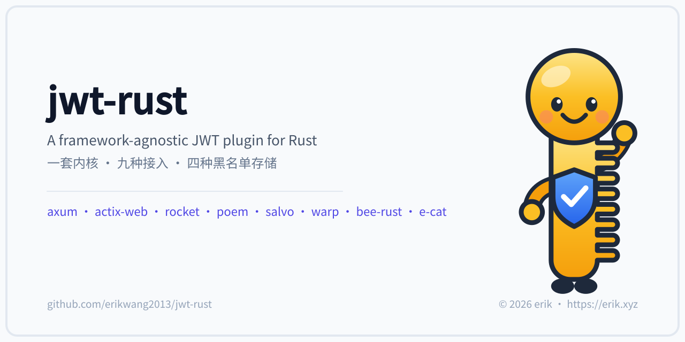
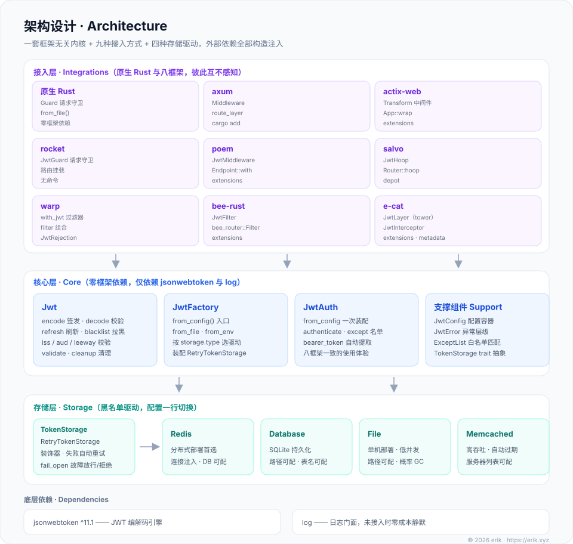
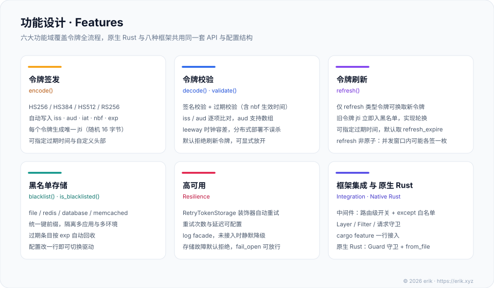
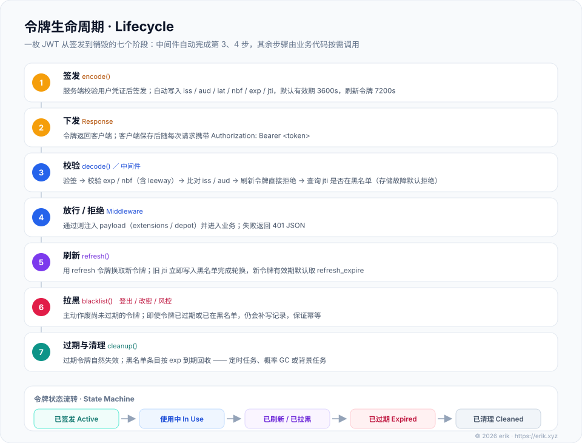

# erikwang2013/jwt-rust

<div align="center">
  
</div>

一款兼容 axum、actix-web、rocket、poem、salvo、warp、bee-rust、e-cat 的 JWT 认证插件，也能直接在原生 Rust（无框架）项目中使用。一套框架无关内核 + 九种接入方式 + 四种可插拔黑名单存储，适用于分布式部署，安装简单快捷。

<div align="center">
  
  <br />
  <sub>项目宠物 · <b>钥匙小卫 Kee</b> —— 钥匙柄是框架无关内核，刃上八颗齿是八个框架适配层，胸前盾牌是校验与黑名单</sub>
</div>

作者：[艾瑞可erik](https://erik.xyz)

## 项目说明

`erikwang2013/jwt-rust` 是一个 Rust 多框架 JWT 认证插件，核心基于 `jsonwebtoken` 封装。

文档以中文为主；架构 / 功能 / 生命周期三图提供英文版（各图下方链接）。

### 定位

传统的 JWT 插件通常只绑定单一框架，在微服务或多项目架构中，不同框架之间需要各自对接不同的 JWT 实现，造成维护成本和认证逻辑不一致的风险。

本插件将核心逻辑与框架完全解耦，通过「一套核心 + 接入层」的架构，在原生 Rust 与 axum、actix-web、rocket、poem、salvo、warp、bee-rust、e-cat 中提供一致的 API 体验。无论后端服务使用哪个框架，JWT 的编码、解码、刷新、黑名单逻辑完全一致，只需按照各框架的习惯方式注册即可；不带框架的项目可以直接使用内核与 `native::Guard` 请求守卫。

### 架构

整体分为「接入层 → 框架无关内核 → 可插拔存储层 → 底层依赖」四层，依赖单向向下，任何一层都能独立替换：


<sub>English: <a href="./docs/architecture.en.svg">architecture.en.svg</a></sub>

核心层不依赖任何框架类型，所有外部依赖（配置、日志、存储连接）通过构造函数或工厂方法注入。每个框架的适配层只负责按该框架的惯用法接入请求、调用同一个核心实例、把 payload 放回框架的惯用位置。逐文件的模块说明见 [项目结构](#项目结构)。

### 设计理念

- **框架无关核心**：核心代码零框架依赖，可在任何 Rust 1.88+ 项目中使用
- **原生深度集成**：每个框架适配层遵循各自的惯用写法（Layer / 中间件 / 过滤器 / 请求守卫），而非生硬地统一封装
- **统一配置格式**：九种接入方式共用一套配置结构与同一组 `JWT_*` 环境变量名
- **存储驱动可插拔**：黑名单支持 file / redis / database / memcached 四种后端，通过配置切换
- **渐进式接入**：依赖即 cargo feature——不加 feature 只用核心，需要哪个框架就加哪个 feature，存储驱动同理；可从最简单的 file 存储起步，业务增长后无缝切换到 redis 或 database

## 项目结构

```
jwt-rust/
├── src/                               核心与九种接入方式
│   ├── lib.rs                         crate 根：公共导出 + feature 门控模块
│   ├── error.rs                       核心：异常层级 JwtError（错误码 1-6 与 PHP 版一一对应）
│   ├── config.rs                      核心：配置容器 JwtConfig，环境变量 / TOML / builder 三种入口
│   ├── jwt.rs                         核心：Jwt 令牌编解码、刷新、黑名单、清理 + JwtPayload + bearer_token()
│   ├── factory.rs                     核心：工厂 JwtFactory，按配置组装内核与存储
│   ├── native.rs                      核心：无框架请求守卫 Guard + 统一 401 响应体 unauthorized_body()
│   ├── middleware_support.rs          核心：中间件共用的 except 白名单匹配 ExceptList
│   ├── mascot.rs                      宠物：终端横幅 banner() 与矢量形象 svg()
│   ├── storage/                       存储：黑名单驱动
│   │   ├── mod.rs                     TokenStorage trait 抽象 + 键名净化
│   │   ├── file.rs                    FileTokenStorage（原子写、概率 GC）
│   │   ├── redis.rs                   RedisTokenStorage（feature redis）
│   │   ├── database.rs                DatabaseTokenStorage（feature database，SQLite）
│   │   ├── memcached.rs               MemcachedTokenStorage（feature memcached）
│   │   └── retry.rs                   RetryTokenStorage：装饰器，失败自动重试
│   └── integrations/                  接入层：八框架适配 + 共享门面 JwtAuth
│       ├── mod.rs                     JwtAuth：一次装配 Jwt + except 名单（八框架共用）
│       ├── axum.rs / actix.rs / rocket.rs / poem.rs / salvo.rs / warp.rs
│       ├── bee_rust.rs                bee-rust：bee_router::Filter 实现
│       └── ecat.rs → ecat/grpc.rs     e-cat：tower Layer（+ feature ecat-grpc 下的 gRPC 拦截器）
├── tests/                             集成测试（29 个用例）：八个框架适配层 + e-cat gRPC
├── examples/
│   └── mascot.rs                      可运行示例：打印宠物横幅与 svg 字节数
├── docs/                              文档与图形资源
│   ├── pet.svg                        项目宠物「钥匙小卫 Kee」
│   ├── architecture.svg               架构设计图（英文版 architecture.en.svg）
│   ├── features.svg                   功能设计图（英文版 features.en.svg）
│   ├── lifecycle.svg                  令牌生命周期图（英文版 lifecycle.en.svg）
│   ├── icon.svg / favicon.ico         站点图标（矢量源 + 浏览器 favicon）
│   ├── icon-{512,192,128}.png         PWA / 应用图标（三档尺寸）
│   ├── social-preview.svg / .png      社交预览图（矢量源 + 位图）
│   └── weixinpay.png / alipay.png     赞赏码
├── Cargo.toml                         包定义与 feature 门控
└── LICENSE                            MIT
```

## 测试

```sh
cargo test --all-features
```

**109 个用例全部通过**（79 个核心与存储单元测试 + 29 个八框架适配层集成测试 + 1 个文档测试；另有 1 个 rocket 用法示例文档测试标为 `ignored`）。

- 核心与存储单元测试：配置加载与默认值、错误分级与文案、编解码（含 iss / aud / leeway / 过期）、刷新轮换、黑名单、四种存储驱动的原子写与概率 GC、except 白名单匹配、宠物横幅
- 框架集成测试：逐框架验证「无 token → 401 统一 JSON 体 / 有效 token 放行且 payload 可取 / except 白名单 / 过期令牌 → 401 具体文案」，并锁定各自的 404、响应头等语义；e-cat 另含 gRPC 拦截器的 metadata 有无 token 两类场景
- redis / memcached 驱动的测试要求本机服务可用：可用时执行完整往返断言（含 SETEX TTL、>30 天 TTL 协议坑），不可用时打印 skip 而非失败

## 架构设计


<sub>English: <a href="./docs/architecture.en.svg">architecture.en.svg</a></sub>

| 层 | 职责 | 约束 |
|------|------|------|
| **接入层** | 原生 Rust 用 `native::Guard` 守卫请求；八框架用各自的惯用机制（tower Layer / 中间件 / 过滤器 / 请求守卫）接入 | 九种接入方式互不感知，核心不反向依赖任何一方 |
| **框架无关内核** | 令牌编解码、刷新、黑名单、异常分级、配置与工厂 | 零框架类型，仅依赖 `jsonwebtoken` 与 `log` facade |
| **可插拔存储层** | 黑名单读写、过期回收、故障策略 | 只认 `TokenStorage` trait；驱动与 `fail_open` 由配置决定 |
| **底层依赖** | JWT 编解码引擎与日志 | 未接入 logger 时 `log` 宏零成本静默，等价 PHP 的 NullLogger |

## 功能设计


<sub>English: <a href="./docs/features.en.svg">features.en.svg</a></sub>

## 令牌生命周期


<sub>English: <a href="./docs/lifecycle.en.svg">lifecycle.en.svg</a></sub>

一枚令牌从签发到销毁共七个阶段：**签发 → 下发 → 校验 → 放行 / 拒绝 → 刷新 → 拉黑 → 过期与清理**。其中第 3、4 步由中间件（原生 Rust 下是 `native::Guard`）自动完成，其余步骤由业务代码按需调用。刷新采用轮换策略——旧 `jti` 在换发新令牌的同时进入黑名单，因此同一枚刷新令牌不会被重复使用（换发动作本身非原子，见[注意事项](#refresh-非原子与无-exp-刷新令牌)）；新令牌的有效期默认取 `refresh_expire`。

## 功能特性

- JWT 令牌生成（支持 HS256 / HS384 / HS512 / RS256 算法）
- 令牌验证（支持时间容差 leeway）
- 刷新令牌（Refresh Token，刷新即轮换：旧 `jti` 在换发时立即入黑名单）
- 令牌黑名单（支持 redis、database、memcached、file 四种存储驱动）
- 存储操作失败自动重试，故障时可配置放行或拒绝
- 原生 Rust 直接可用：`native::Guard` 请求守卫 + TOML / 环境变量配置，零框架依赖
- 八框架深度集成：中间件 / 过滤器 / 请求守卫，按框架惯用法接入
- e-cat gRPC 拦截器（PHP 版无对等能力）：tonic `InterceptorLayer` 挂在服务上，与 HTTP 层共用同一套校验与黑名单

## 安装

```sh
cargo add jwt-rust --features axum
```

或手写 `Cargo.toml`：

```toml
[dependencies]
jwt-rust = { version = "1.0", features = ["axum"] }
```

默认不启用任何 feature（`default = []`）：不加 feature 只编译框架无关核心，零框架依赖；按需叠加。

| feature | 内容 |
|------|------|
| （无，默认） | 框架无关内核 + 原生 Rust `Guard` + file 存储 |
| `axum` | axum 适配（`JwtLayer`，tower Layer） |
| `actix` | actix-web 适配（`Jwt`，Transform 中间件） |
| `rocket` | rocket 适配（`JwtGuard` 请求守卫 + `jwt_unauthorized` catcher） |
| `poem` | poem 适配（`JwtMiddleware`） |
| `salvo` | salvo 适配（`JwtHoop`） |
| `warp` | warp 适配（`with_jwt` 过滤器 + `JwtRejection`） |
| `bee-rust` | bee-rust 适配（`JwtFilter`，`bee_router::Filter`） |
| `ecat` | e-cat HTTP 适配（tower Layer，复用 axum 适配套件） |
| `ecat-grpc` | e-cat gRPC 拦截器（`JwtInterceptor`，含 `ecat`） |
| `redis` | Redis 黑名单驱动 |
| `database` | SQLite 黑名单驱动（rusqlite，bundled） |
| `memcached` | Memcached 黑名单驱动 |

**构建要求**：`jsonwebtoken` 11.x 固定 `aws_lc_rs` 加密后端（禁止选择存在已知漏洞的 `rust_crypto` 后端），因此构建需要 C 工具链——`cmake` 与 C 编译器 / 汇编器（Linux 下通常是 `build-essential` / `gcc`）。这是加密后端本身的构建依赖，与是否启用框架 feature 无关。

**MSRV**：核心与其余 feature 需 rustc ≥ 1.88（`rust-version = "1.88"`，edition 2024）；`salvo` feature 需 rustc ≥ 1.94。

## 核心 API

`JwtFactory` 是内核的组装入口，`Jwt` 是令牌 API 本身（对应 PHP 版的 `JWTFactory` / `JWT`，便捷封装与自动取头做在同层）：

```rust
use std::path::Path;
use jwt_rust::factory::JwtFactory;
use jwt_rust::jwt::bearer_token;

// 三种装配方式：环境变量（JWT_*）/ TOML 文件 / 直接给 JwtConfig
let jwt = JwtFactory::from_env()?;
let jwt = JwtFactory::from_file(Path::new("jwt.toml"))?;
let jwt = JwtFactory::from_config(config)?;

// 生成令牌（不传过期时间时按 default_expire）
let token = jwt.encode(&serde_json::json!({"user_id": 1}), None)?;

// 生成令牌并指定过期时间（秒）
let token = jwt.encode(&serde_json::json!({"user_id": 1}), Some(7200))?;

// 刷新令牌用 token_type 标记；自动取 refresh_expire
let refresh = jwt.encode(&serde_json::json!({"user_id": 1, "token_type": "refresh"}), None)?;

// 校验令牌，返回 payload
let payload = jwt.decode(&token)?;
let user_id = payload["user_id"].as_i64();

// Rust 惯用便捷：直接反序列化为自定义类型
#[derive(serde::Deserialize)]
struct Claims { user_id: i64 }
let claims: Claims = jwt.decode_as(&token)?;

// 仅判断有效性（不返回 payload、不抛错）
if jwt.validate(&token) { /* ... */ }

// 从 Authorization 头取令牌（前缀大小写不敏感、容忍空白），自己决定响应方式时用
if let Some(token) = bearer_token(header_value) { /* ... */ }

// 刷新令牌（换发并轮换，旧 jti 立即入黑名单）
let new_token = jwt.refresh(&refresh, None)?;

// 拉黑令牌（登出）
jwt.blacklist(&token)?;

// 检查令牌是否在黑名单（不验签，只按 jti 查询）
if jwt.is_blacklisted(&token) { /* ... */ }

// 清理过期黑名单条目，建议放进定时任务
jwt.cleanup()?;
```

适用所有框架，只需把装配方式换成对应框架的写法即可。

**401 响应体契约**：八框架适配层与 `native::unauthorized_body()` 共用同一格式，拒绝时一律输出：

```json
{"code":401,"msg":"Token not provided","data":null}
```

`msg` 取 `JwtError::user_message()`：鉴权类错误（过期 / 无效 / 黑名单）返回具体原因，其余（存储 / 配置 / 网络）统一为 `Token authentication failed`，不向外泄露内部错误。`except` 白名单命中的路径直接跳过鉴权。

## 原生 Rust（无框架）使用

核心不依赖任何框架类型，原生 Rust 项目两步即可接入。

**1. 准备配置**：环境变量（`JWT_*`，见[配置文件参考](#配置文件参考)）或一个 TOML 文件：

```toml
# 至少 32 字符（256 位）
secret_key = "replace-with-a-key-of-at-least-32-chars"
algorithm = "HS256"

[middleware]
except = ["api/login"]
```

**2. 入口处创建守卫并校验请求**：

```rust
use std::path::Path;
use jwt_rust::native::{unauthorized_body, Guard};

let guard = Guard::from_file(Path::new("jwt.toml"))?;
// 或 Guard::from_env()? / Guard::from_config(config)?

// 校验失败时按与八框架完全一致的 401 JSON 输出——Rust 无全局请求对象，
// "输出并结束"由调用方完成：require_auth 只返回错误，响应体交给 unauthorized_body
let header = /* Authorization 头值，取自你的 HTTP 库 */;
let token = jwt_rust::jwt::bearer_token(header);
match guard.require_auth(token.as_deref()) {
    Ok(payload) => { /* userId = payload["user_id"] */ }
    Err(e) => {
        // 用你的 HTTP 库输出：状态码 401 + unauthorized_body(&e).to_string()
        // 响应体：{"code":401,"msg":…,"data":null}
    }
}
```

需要自行决定响应方式时，改用 `authenticate()` 或 `check()`：

```rust
use jwt_rust::JwtError;

match guard.authenticate(token.as_deref()) {
    Ok(payload) => { /* 处理业务 */ }
    Err(e) => {
        // e.user_message() 是对外安全的提示文案，用它组织你自己的 401 响应
    }
}

if guard.check(token.as_deref()) { /* 只判断有效性，不处理错误 */ }
```

**签发、刷新、拉黑：**

```rust
let jwt = guard.jwt();

let token   = jwt.encode(&serde_json::json!({"user_id": 1}), None)?;   // 访问令牌
let refresh = jwt.encode(&serde_json::json!({"user_id": 1, "token_type": "refresh"}), None)?;
let new     = jwt.refresh(&refresh, None)?;                            // 换发并轮换旧令牌
jwt.blacklist(&token)?;                                                // 登出
jwt.cleanup()?;                                                        // 建议放进定时任务
```

## 各框架使用说明

八框架共用同一个门面 `JwtAuth`（一次装配 `Jwt` 实例与 `except` 名单），按框架惯用法注册即可。

---

### axum

**依赖：** `jwt-rust = { version = "1.0", features = ["axum"] }`

```rust
use std::sync::Arc;
use axum::extract::Extension;
use axum::routing::get;
use axum::Router;
use jwt_rust::config::{JwtConfig, MiddlewareConfig};
use jwt_rust::integrations::axum::JwtLayer;
use jwt_rust::integrations::JwtAuth;
use jwt_rust::jwt::JwtPayload;

let auth = JwtAuth::from_config(JwtConfig {
    secret_key: "0123456789abcdef0123456789abcdef".into(),
    middleware: MiddlewareConfig { except: vec!["/api/login".into()] },
    ..Default::default()
})?;

let app = Router::new()
    .route("/api/me", get(|Extension(p): Extension<JwtPayload>| async move {
        format!("user={}", p.get("user_id").unwrap())
    }))
    .route("/api/login", get(|| async { "public" }));

// attach() = route_layer：只包已注册路由，保持 404 语义
let app = JwtLayer::new(Arc::new(auth)).attach(app);
```

**payload 获取：** `Extension<JwtPayload>` 提取器，或在中间件/处理器里 `req.extensions().get::<JwtPayload>()`。

**注意：**

- `attach`（内部即 `Router::route_layer`）只对已注册路由生效——未匹配路径保持 404、不经鉴权；改用 `Router::layer(JwtLayer::new(...))` 会把层同时套到 fallback，未匹配路径在无 token 时也会以 401 作答
- 对**空路由**（未注册任何路由）调用 `attach` 会 panic（axum `route_layer` 的设计），请至少注册一条路由后再挂
- `nest` 会把前缀从内层看到的路径中剥掉，**挂在 nest 子树内的层，except 名单要用子路由的相对路径**书写
- CORS 预检（`OPTIONS`）也走鉴权：需要在外层用 `CorsLayer` 短路预检，或自行注册 OPTIONS 路由

---

### actix-web

**依赖：** `jwt-rust = { version = "1.0", features = ["actix"] }`

```rust
use std::sync::Arc;
use actix_web::{web, App, HttpMessage, HttpRequest, HttpResponse};
use jwt_rust::config::JwtConfig;
use jwt_rust::integrations::actix::Jwt;
use jwt_rust::integrations::JwtAuth;
use jwt_rust::jwt::JwtPayload;

let auth = Arc::new(JwtAuth::from_config(JwtConfig {
    secret_key: "0123456789abcdef0123456789abcdef".into(),
    middleware: jwt_rust::config::MiddlewareConfig { except: vec!["/api/login".into()] },
    ..Default::default()
})?);

async fn me(req: HttpRequest) -> HttpResponse {
    match req.extensions().get::<JwtPayload>() {
        Some(p) => HttpResponse::Ok().body(format!("user={}", p.get("user_id").unwrap())),
        None => HttpResponse::Ok().body("none"),
    }
}

async fn login() -> HttpResponse {
    HttpResponse::Ok().body("public")
}

let app = App::new()
    .wrap(Jwt::new(auth.clone()))                 // App::wrap 覆盖所有请求
    .route("/api/me", web::get().to(me))
    .route("/api/login", web::get().to(login));
```

**payload 获取：** `req.extensions().get::<JwtPayload>()`。

**注意：** `App::wrap` 覆盖**所有**请求——未匹配路径在无 token 时也会得 401 而非 404（actix-web 没有 axum `route_layer` 的等价物）。需要 404 语义时把守卫挂到 `Scope::wrap` / `Resource::wrap`，或用 `App::default_service` 兜底。

---

### rocket

**依赖：** `jwt-rust = { version = "1.0", features = ["rocket"] }`

rocket 惯例是「按路由挂守卫」：公开路由不挂 `JwtGuard` 即可，`except` 名单在 rocket 下就是这个语义（挂了守卫的 except 路径会显式报 500 用法错误）。

```rust
use rocket::http::Status;
use jwt_rust::config::JwtConfig;
use jwt_rust::integrations::rocket::{jwt_unauthorized, JwtGuard};
use jwt_rust::integrations::JwtAuth;

#[rocket::get("/me")]
fn me(p: JwtGuard) -> String {
    format!("user={}", p.0.get("user_id").unwrap())
}

#[rocket::launch]
fn rocket() -> _ {
    let auth = JwtAuth::from_config(JwtConfig {
        secret_key: "0123456789abcdef0123456789abcdef".into(),
        ..Default::default()
    }).unwrap();
    rocket::build()
        .manage(std::sync::Arc::new(auth))                        // 1. 注入 JwtAuth
        .register("/", rocket::catchers![jwt_unauthorized])       // 2. 注册 401 catcher
        .mount("/", rocket::routes![me])
}
```

**payload 获取：** guard 参数即 payload，经 `p.0` 读取（`JwtGuard(pub JwtPayload)`）。

**注意：**

- **两处注册缺一不可**：`.manage(Arc::new(auth))` 供守卫取状态；`.register("/", rocket::catchers![jwt_unauthorized])` 渲染统一 401 JSON 体——rocket 0.5 的守卫失败只把状态码交给 catcher，不注册 catcher 时响应体是 rocket 默认文案
- `register("/", …)` 会接管**全应用**的 401（包括你自己路由里 `return Status::Unauthorized` 这类非守卫来源，统一改写成兜底文案 `Token authentication failed`）。若应用存在非 JWT 语义的 401，请把 catcher 注册在受保护路由的公共前缀下（如 `.register("/api", …)`），自己的 401 catcher 挂更深路径
- 勿在相同 base 重复注册 401 catcher：rocket 视「同状态码 + 同 base」为冲突，启动期报错

---

### poem

**依赖：** `jwt-rust = { version = "1.0", features = ["poem"] }`

```rust
use std::sync::Arc;
use poem::{EndpointExt, Route};
use jwt_rust::config::JwtConfig;
use jwt_rust::integrations::poem::JwtMiddleware;
use jwt_rust::integrations::JwtAuth;

let auth = Arc::new(JwtAuth::from_config(JwtConfig {
    secret_key: "0123456789abcdef0123456789abcdef".into(),
    middleware: jwt_rust::config::MiddlewareConfig { except: vec!["/api/login".into()] },
    ..Default::default()
})?);

// 挂在 Route 上：该 Route 收到的所有请求都过鉴权
let app = Route::new()
    .at("/api/me", me)
    .at("/api/login", login)
    .with(JwtMiddleware::new(auth.clone()));

// 或按单条路由挂，公开路由不挂：
// let app = Route::new().at("/api/me", me.with(JwtMiddleware::new(auth.clone())));
```

**payload 获取：** `req.extensions().get::<JwtPayload>()`。

**注意：**

- `.with` 覆盖该 endpoint 收到的**所有**请求——未匹配路径在无 token 时同样得 401 而非 404（poem 没有 `route_layer` 等价物）；需要 404 语义就按单条路由挂
- `nest` 默认剥掉前缀：中间件挂在 nest 子树内时，看到的路径是剥离子树后的（`/api/login` → `/login`），**except 名单须按剥离子树书写**；`.with` 挂在外层 `Route` 上则看到全路径——两种挂法结论相反
- `nest_no_strip` 下内层路由要写全路径

---

### salvo

**依赖：** `jwt-rust = { version = "1.0", features = ["salvo"] }`（需 rustc ≥ 1.94）

```rust
use salvo::prelude::*;
use jwt_rust::config::JwtConfig;
use jwt_rust::integrations::salvo::JwtHoop;
use jwt_rust::integrations::JwtAuth;

#[handler]
async fn me(depot: &mut Depot, res: &mut Response) {
    let user = depot
        .get_typed::<jwt_rust::jwt::JwtPayload>()
        .map(|p| p.get("user_id").unwrap().to_string())
        .unwrap_or_else(|_| "none".into());
    res.render(Text::Plain(format!("user={user}")));
}

let auth = std::sync::Arc::new(JwtAuth::from_config(JwtConfig {
    secret_key: "0123456789abcdef0123456789abcdef".into(),
    middleware: jwt_rust::config::MiddlewareConfig { except: vec!["/api/login".into()] },
    ..Default::default()
})?);

let router = Router::new()
    .hoop(JwtHoop::new(auth.clone()))
    .push(Router::with_path("api/me").get(me))
    .push(Router::with_path("api/login").get(login));
```

**payload 获取：** `depot.get_typed::<JwtPayload>()`（`obtain` 自 salvo 0.94 起为 deprecated 别名）。

**注意：**

- `Router::hoop` 只在路由匹配成功时运行：未匹配路径保持 404、方法不匹配 405，**不过鉴权**（与 axum `attach` 同理）
- `hoop` 挂在哪层就只对哪层子树生效，且 `with_path` 不剥前缀——`req.uri().path()` 看到的始终是完整路径，except 名单一律按全路径书写
- 需要整站覆盖（未匹配路径也 401）请改挂服务层：`Service::new(router).hoop(JwtHoop::new(auth))`

---

### warp

**依赖：** `jwt-rust = { version = "1.0", features = ["warp"] }`

```rust
use std::sync::Arc;
use warp::Filter;
use jwt_rust::config::JwtConfig;
use jwt_rust::integrations::warp::{with_jwt, JwtRejection};
use jwt_rust::integrations::JwtAuth;
use jwt_rust::jwt::JwtPayload;

let auth = Arc::new(JwtAuth::from_config(JwtConfig {
    secret_key: "0123456789abcdef0123456789abcdef".into(),
    ..Default::default()
})?);

let route = warp::path!("me")
    .and(with_jwt(auth.clone()))                 // 过滤器输出 JwtPayload，透传给下游
    .map(|p: JwtPayload| format!("user={}", p.get("user_id").unwrap()))
    .recover(|rej: warp::Rejection| async move {  // 必须挂：把拒绝渲染成统一 401 JSON
        match rej.find::<JwtRejection>() {
            Some(j) => Ok(warp::reply::with_status(warp::reply::json(&j.body), j.status)),
            None => Err(rej),
        }
    });
```

**payload 获取：** `with_jwt` 过滤器的提取结果（`JwtPayload`），直接在 `.and(...)` 之后的 `.map` 里使用。

**注意：** `.recover(...)` 是必需件——未 recover 时 warp 把 `JwtRejection` 当陌生自定义拒绝，渲染 500 `text/plain`。warp 没有「路由级跳过」的过滤器语义，except 路由请直接不挂 `with_jwt`（挂了会得到显式 500 用法错误提示）。except 名单按全路径书写（不含 query）。

---

### bee-rust

**依赖：** `jwt-rust = { version = "1.0", features = ["bee-rust"] }`

```rust
use std::sync::Arc;
use jwt_rust::config::JwtConfig;
use jwt_rust::integrations::bee_rust::JwtFilter;
use jwt_rust::integrations::JwtAuth;

let auth = Arc::new(JwtAuth::from_config(JwtConfig {
    secret_key: "0123456789abcdef0123456789abcdef".into(),
    middleware: jwt_rust::config::MiddlewareConfig { except: vec!["/api/login".into()] },
    ..Default::default()
})?);

// 过滤器随 dispatch 传入（bee-rust 自带 SecurityFilter 同款写法）
let filter = JwtFilter::new(auth.clone());
ctx.dispatch(cache, ttl, &[&filter], &controller).await?;
```

**payload 获取：** `ctx.request.extensions().get::<JwtPayload>()`。

**注意：** 拒绝时经 `ctx.abort(401, body)` 终止并输出统一 JSON 体，`Content-Type` 为裸 `application/json`（与其余七个适配层逐字节一致）。except 路径直接放行且不注入 payload。

---

### e-cat

**HTTP 层依赖：** `jwt-rust = { version = "1.0", features = ["ecat"] }`

e-cat 的 HTTP transport 即 axum，适配层与 `integrations::axum` 是同一对类型（同一套 `JwtLayer` / `JwtService`）：

```rust
use jwt_rust::integrations::ecat::JwtLayer;

let app = router.layer(JwtLayer::new(std::sync::Arc::new(auth)));
```

**gRPC 层依赖：** `jwt-rust = { version = "1.0", features = ["ecat-grpc"] }`

```rust
use tower::Layer;
use tonic::service::InterceptorLayer;
use jwt_rust::integrations::ecat::grpc::JwtInterceptor;

// 按服务挂载，再交 Routes::add_service
let svc = InterceptorLayer::new(JwtInterceptor::new(auth.clone())).layer(svc);
routes.add_service(svc);
```

**payload 获取：** HTTP 层与 axum 一致（`req.extensions().get::<JwtPayload>()`）；gRPC 层校验通过后 claims 注入请求 extensions，token 从 gRPC metadata 的 `authorization` 键读取（`Bearer` 前缀规则与 HTTP 层相同）。

**注意：**

- gRPC 层失败以 `Status::unauthenticated(user_message)` 返回（gRPC 惯例，无 HTTP 体）
- gRPC **没有 except 白名单**：拦截器只见 metadata / extensions，`middleware.except` 对 gRPC 不生效；公开方法=该服务不挂本层（按服务挂载，全局挂载会连 health / reflection 一并拦）
- **与 `ecat-auth::JwtAuthLayer` 的关系**：后者负责基础鉴权（签名 / iss / aud / claims / 过期），无黑名单、无刷新、无存储；jwt-rust 的 e-cat 适配层提供完整令牌治理（签发 / 刷新 / 黑名单 / 四种存储）。二者可共存，按需选用

---

## 配置文件参考

环境变量名与 PHP 版逐字相同，共 18 个（`JwtConfig::from_env()` 读取）：

| 环境变量 | 默认值 | 说明 |
|------|------|------|
| `JWT_SECRET_KEY` | （必填） | 签名密钥，至少 32 字符（256 位）；RS256 时为私钥 PEM |
| `JWT_ALGORITHM` | `HS256` | 签名算法：HS256 / HS384 / HS512 / RS256 |
| `JWT_ISSUER` | 空 | 签发者标识，空则不校验 |
| `JWT_AUDIENCE` | 空 | 受众标识，空则不校验（令牌的 aud 为数组时按包含匹配） |
| `JWT_LEEWAY` | `0` | 时间容差（秒），用于处理服务器时钟偏差 |
| `JWT_DEFAULT_EXPIRE` | `3600` | 默认令牌过期时间（秒） |
| `JWT_REFRESH_EXPIRE` | `7200` | 刷新令牌过期时间（秒） |
| `JWT_STORAGE_TYPE` | `file` | 存储类型：file / redis / database / memcached |
| `JWT_STORAGE_PREFIX` | `jwt_blacklist:` | 缓存键前缀（redis / memcached） |
| `JWT_STORAGE_PATH` | 系统临时目录/jwt_blacklist | file 驱动目录；database 驱动为 SQLite 路径或 URI（留空为私有内存库） |
| `JWT_STORAGE_TABLE` | `jwt_blacklist` | database 驱动表名 |
| `JWT_STORAGE_AUTO_CREATE_TABLE` | `true` | database 驱动是否自动建表（账号无 DDL 权限时置 false） |
| `JWT_STORAGE_GC_PROBABILITY` | `0.1` | file 驱动每次写入触发过期清理的概率，0 关闭并交给定时任务 |
| `JWT_STORAGE_FAIL_OPEN` | `false` | 存储故障时：false 拒绝所有令牌；true 放行并记 error 日志 |
| `JWT_ADVANCED_RETRY_ATTEMPTS` | `3` | 存储操作失败重试次数（1 表示不包装重试） |
| `JWT_ADVANCED_RETRY_DELAY` | `100` | 重试延迟（毫秒） |
| `JWT_AUTO_CLEANUP` | `false` | 保留字段：Rust 版**不自动执行**，供背景任务读取 |
| `JWT_CLEANUP_INTERVAL` | `3600` | 自动清理间隔（秒），同上 |

布尔的解析规则与 PHP `FILTER_VALIDATE_BOOLEAN` 一致：`1` / `true` / `yes` / `on`（trim 后、大小写不敏感）为真，其余为假；数值解析失败时回落到默认值。

**TOML 配置文件**（`JwtFactory::from_file()`，键名与本表字段一一对应）：

```toml
# 签名密钥，至少 32 字符（256 位）
secret_key = "0123456789abcdef0123456789abcdef"
# 签名算法：HS256 / HS384 / HS512 / RS256
algorithm = "HS256"
# 签发者 / 受众标识，留空则不校验
issuer = ""
audience = ""
# 时间容差（秒）
leeway = 0
# 默认令牌过期时间（秒）
default_expire = 3600
# 刷新令牌过期时间（秒）
refresh_expire = 7200

[storage]
# 存储类型：file / redis / database / memcached
type = "file"
# 缓存键前缀
prefix = "jwt_blacklist:"
# file 驱动：黑名单目录；database 驱动：SQLite 路径或 URI（留空为私有内存库）
# path = "/var/lib/app/jwt_blacklist"
# database 驱动：表名
table_name = "jwt_blacklist"
# database 驱动：表已由迁移脚本建好时可关闭自动建表
auto_create_table = true
# file 驱动：每次写入触发过期清理的概率，0 表示关闭并交给定时任务
gc_probability = 0.1
# 存储故障时：false（默认）拒绝所有令牌；true 放行并记 error 日志
fail_open = false
# redis / memcached 驱动：服务器列表（host:port 或完整 URL；仅 TOML 配置，无对应环境变量）
servers = ["127.0.0.1:11211"]

[advanced]
# 存储操作失败重试次数与延迟（毫秒）
retry_attempts = 3
retry_delay = 100
# 保留字段：Rust 版不自动执行，供背景任务读取
auto_cleanup = false
cleanup_interval = 3600

[middleware]
# 排除的路由路径（正则），这些路径不校验 JWT
except = []
```

未知的 TOML 键会被忽略（与 PHP 数组配置同语义）。也可以用 builder 直接构造：`JwtConfig::default().with_secret("…").with_issuer("…")` 等。

**RS256 密钥**：`secret_key` 填**私钥** PEM，支持 PKCS#1（`BEGIN RSA PRIVATE KEY`）与 PKCS#8（`BEGIN PRIVATE KEY`）两种格式。公钥 PEM 会在装配期（`Jwt::new` / `JwtFactory`）直接报配置错误，而不是等到运行期验签失败——配置错误在启动期暴露。

## 存储驱动对比

| 驱动 | feature | 适用场景 |
|------|------|----------|
| `file` | （默认） | 单机部署、低并发 |
| `redis` | `redis` | 分布式部署、高性能 |
| `database` | `database` | 需要持久化、单机文件库（SQLite） |
| `memcached` | `memcached` | 高吞吐量、自动过期 |

四种驱动都实现同一个 `TokenStorage` trait（`blacklist` / `is_blacklisted` / `cleanup`），并被 `RetryTokenStorage` 按 `advanced.retry_attempts` 装饰重试（次数 ≤1 时不包装）。整体存储不可用时的行为由 `storage.fail_open` 决定：

- `false`（默认）：黑名单查不动就拒绝，撤销信息不可信时宁可不放行
- `true`：故障期间放行并记录 error 日志，避免缓存宕机引发全站 401

配置了某种存储类型但没启用对应 feature（如 `JWT_STORAGE_TYPE=redis` 而未加 `redis` feature）时，装配期直接报配置错误并说明缺哪个 feature；未知的存储类型名会告警并回落 file 驱动。

**各驱动语义：**

- `file`：`{path}/{key}.json`，内容 `{jti, expire_time, created_at}`；原子写（临时文件 + rename）、过期即删、概率 GC、cleanup 回收过期条目与写崩残留的临时文件；非十六进制 `jti` 转成十六进制文件名（杜绝路径穿越）
- `redis`：`SETEX` 写入、`EXISTS` 查询；键 = 前缀 + 净化后的 jti；只取 `servers` 首项，未配置则回落 `127.0.0.1:6379`；懒连接，出错置空下次重建；cleanup 为空实现（Redis 自动过期）
- `database`：SQLite（rusqlite，bundled 编译）；写入为幂等 upsert（`INSERT … ON CONFLICT(jti) DO UPDATE`）；表名白名单校验（`[A-Za-z_][A-Za-z0-9_]*`）。**局限**：v1 仅 SQLite——单机文件库，非网络数据库；MySQL / PostgreSQL 等实现 `TokenStorage` trait 即可自行接入
- `memcached`：`set` 写入、读查询；使用全部 `servers`，未配置则回落 `127.0.0.1:11211`；>30 天的 TTL 按绝对时间戳写入（协议坑修复）；键规则同 redis；cleanup 为空实现

## 注意事项

### 刷新令牌不能当访问令牌用

`decode()` / `validate()`（以及八个框架的适配层、`native::Guard`）**默认拒绝 `token_type` 为 `refresh` 的令牌**。刷新令牌有效期更长，且刷新时才会轮换，若允许它直接访问受保护接口，一次泄露就等于长期通行证、登出也不会立即失效。

确实需要读取刷新令牌（例如自定义刷新逻辑）时显式放开：

```rust
let payload = jwt.decode_with(&refresh_token, true)?;
let payload = jwt.decode(&access_token)?;   // 默认行为
```

`refresh()` 与 `blacklist()` 内部已按需放开，不受影响。

### except 白名单的写法

`middleware.except` 是正则列表，匹配前会去掉路径两侧的 `/`，再按整段匹配。**多分支请写无前导斜杠形态**：

```toml
[middleware]
except = ["api/login|api/logout"]        # 正确：两个分支都能命中
# except = ["/api/login|/api/logout"]    # 错误：第二支永不匹配
```

原因是 `trim_matches('/')` 只作用于字符串两端：`"/api/login|/api/logout"` 去两端斜杠后是 `api/login|/api/logout`，第二支的前导斜杠还在，匹配不上路径 `api/logout`。

支持的正则语法有界：`+`、`{n}` 等量词可用；匹配只取「是否整段命中」的布尔结果，捕获组不起作用。量词开头（`*`、`/*` 等）的片段在 Rust 正则引擎下编译失败，会被跳过并告警——即**不匹配任何路径（fail-closed）**，不会静默变成「匹配一切」。整条 pattern 会包进 `^(?:…)$`，顶层 `|` 的锚定因此对两侧都生效。

### jti 格式

本插件签发令牌时用 16 字节随机数的十六进制生成 `jti`（32 位十六进制）。若接入的是其他系统签发、`jti` 为 UUID 等其他格式的令牌，file / redis / memcached 驱动会把非十六进制 jti 转成十六进制或 sha256 再作为键名（既避免路径穿越与非法缓存键，也不改变已有十六进制 jti 的键名），database 驱动直接存原值。

### 存储故障与 fail_open

`decode()` 查询黑名单时若存储抛错，默认向上抛出 `JwtError::Storage`，适配层据此返回 401 —— 这是刻意选择的 fail-closed：撤销信息不可信时不放行。更看重可用性的业务可以显式打开 `storage.fail_open`，此时故障期间签名有效的令牌会被放行，并记录 error 日志。

例外：**file 驱动的读路径**在文件读错误 / 条目损坏时静默视为「未拉黑」（与 PHP 版 `@file_get_contents` 语义对齐），fail-closed 在那里不生效；驱动会记 warn 日志便于排障。

### 刷新令牌的有效期

`refresh()` 不传过期时间时使用配置的 `refresh_expire`（默认 7200 秒），与 `encode(json!({"token_type": "refresh"}), None)` 保持一致；显式传入秒数则以传入值为准。

### refresh 非原子与无 exp 刷新令牌

`refresh()` 的「换发 + 旧 jti 入黑名单」不是原子操作，并发窗口内同一枚刷新令牌可能各签出一枚有效新令牌（PHP 版同样非原子）；旧 jti 在换发时立即入黑名单，但已换发出的新令牌不受影响。另外，外部签发、**没有 `exp` 的刷新令牌**换发后旧令牌不会被写入黑名单（无法确定何时回收），即不可撤销——本插件自己签发的令牌恒有 `exp`，不受影响。

### 常驻进程中的清理

`auto_cleanup` 在 Rust 版**不会自动执行**（无 PHP `register_shutdown_function` 的对等物），字段保留供背景任务读取。请按运行环境用后台任务周期调用 `jwt.cleanup()`：

**tokio 任务：**

```rust
let jwt = /* Arc<Jwt>，与业务共用同一实例 */;
let interval = jwt_config.advanced.cleanup_interval;   // 秒
tokio::spawn(async move {
    loop {
        tokio::time::sleep(std::time::Duration::from_secs(interval)).await;
        if let Err(e) = jwt.cleanup() { log::error!("JWT cleanup failed: {e}"); }
    }
});
```

**其他环境**：交给框架/系统的定时器（如 salvo、actix 的定时任务，或宿主机 cron 触发一个管理端点）调用同一方法即可——清理是无状态幂等操作。

### 存储键名长度与外部 jti

file 驱动对非十六进制 `jti` 做逐字节十六进制转写（长度翻倍），写入时先落临时名 `{转写}.json.tmp.{8 位随机十六进制}`（比最终名多 13 字节），文件名超过常见文件系统的 `NAME_MAX`（255 字节）时报 Storage 错误——换算即非 hex `jti` 超过 118 字节即失败；外部 UUID（36 字符 → 72 字节）等常规输入安全；超长外部 jti 请改用 redis / database 驱动（键长度不受文件系统限制）。

### JWT_LEEWAY 别开太大

建议 `JWT_LEEWAY` ≤ 86400。过大的容差会让 `jsonwebtoken` 内部在 debug 构建下发生整数下溢 panic；release 构建会回绕成「全量过期」（fail-closed，拒绝所有令牌）。两者都不是你想要的运行形态。

### iat 不校验

`iat`（签发时间）仅写入、不参与校验：即使令牌的 `iat` 为未来时间也照常放行（与 firebase/php-jwt 6.9+ 在有 `nbf` 时的行为一致——本插件签发的令牌恒有 `nbf` 参与校验，仅外部签发的无 `nbf` 令牌会走到这一差异）。

### 401 文案与过期边界

- `bearer_token` 用 Unicode 空白做 trim，比 PHP 版的 ASCII 空白面略宽；多接受的输入仍须完整验签
- 过期判定边界与 PHP 版相差 1 秒：`jsonwebtoken` 在 `exp < now - leeway` 判过期，PHP `firebase/php-jwt` 为 `now - leeway >= exp`——`exp == now - leeway` 时 Rust 放行、PHP 过期（窗口 1 秒，其余行为一致）

## 项目宠物


**钥匙小卫 Kee** 是本项目的吉祥物，造型就是这套架构本身：

- **钥匙柄**（圆头带表情）—— 框架无关内核：认得所有令牌，不认框架
- **刃上八颗齿** —— axum / actix-web / rocket / poem / salvo / warp / bee-rust / e-cat 八个适配层，形状一致、位置固定
- **没有第九颗齿** —— 原生 Rust 项目直接使用内核，不需要适配层
- **胸前盾牌** —— 校验与黑名单：验签通过才会亮起

形象文件 `docs/pet.svg` 是纯矢量、无脚本、无外部依赖的单个文件，动画使用 SMIL 实现，可直接嵌入任何页面或文档，也被 `mascot::svg()` 用 `include_str!` 编译期内嵌进 crate。

### 在代码里使用

```rust
use jwt_rust::mascot;

// 终端横幅：color=None 时自动探测 TTY 决定是否着色，可强制 mascot::banner(Some(true)) 或 mascot::banner(Some(false))
print!("{}", mascot::banner(None));

// 矢量形象：同样的形象可以直接输出给浏览器或写进视图
let svg: &'static str = mascot::svg();
```

可运行示例（打印横幅与 svg 字节数）：

```sh
cargo run --example mascot
```

## 开源不易，欢迎支持 | Open Source is Not Easy, Your Support is Welcome

| 微信 WeChat | 支付宝 Alipay |
|:---:|:---:|
|  |  |

---

## 开源协议

MIT © 2026 [erik](https://erik.xyz)
